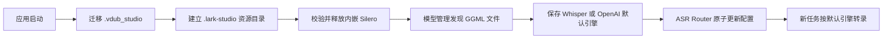

# Lark Studio ASR 与模型资源方案

## 已确认行为

- Silero VAD 模型为跨平台 ONNX 数据文件，大小 885,098 字节；将其嵌入 Go 程序，启动时校验并写入 `~/.lark-studio/models/ggml-silero-v6.2.0.bin`。
- Whisper 任务使用本地 Silero 文件；启动准备资源失败时程序报错退出，避免运行任务时才发现模型缺失。
- `.vdub_studio` 迁移到 `.lark-studio`。目标不存在时整体改名；目标存在时合并，目标同名文件优先，旧文件以 `.from-vdub_studio` 后缀保留。
- 模型管理保留可下载的推荐模型，并发现统一 models 目录中的 `ggml-*.bin` 文件；Silero 作为 VAD 资源显示，不作为 Whisper ASR 可选项。
- ASR 引擎仅保留实际接线的 Whisper.cpp 与 OpenAI 兼容引擎。OpenAI 使用 `/v1/audio/transcriptions`，输出 SRT；默认引擎保存后即时作用于新任务。
- 移除页面黄色闪电图标及用户点名的三条说明文案。

## 流程

## 验收检查点

1. 迁移测试覆盖目标缺失、目录合并、同名目标文件优先且旧文件有备份。
2. Silero 内嵌字节摘要正确，启动释放出的文件与源资源摘要一致；Whisper 调用使用统一 models 目录。
3. 模型列表包含推荐下载项、额外 GGML 文件和 Silero VAD 资源；未下载的 tiny 文件仍可被发现。
4. ASR 配置持久化后重新读取字段一致；OpenAI mock 验证 multipart 文件、模型、语言、SRT 响应及错误处理。
5. 前端页面无 SenseVoice、闪电图标和三条指定说明；两种引擎保存后配置值正确。
6. Go 测试、Go 静态检查及前端构建通过。
