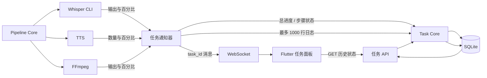
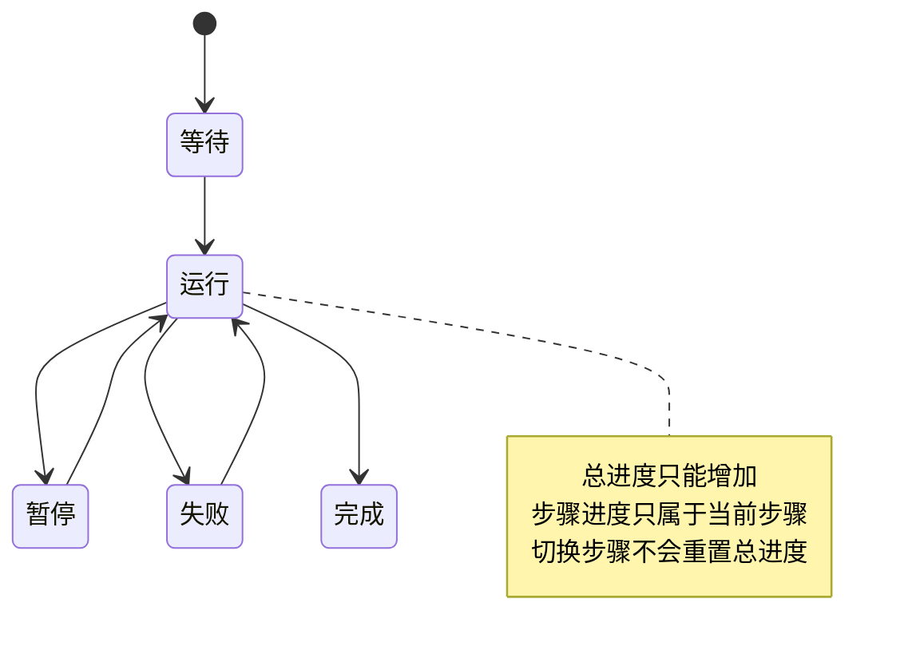

# 任务可观测性数据流

```mermaid
flowchart LR
    UI["Flutter 任务面板"] -->|"GET 历史状态"| API["任务 API"]
    API --> CORE["Task Core"]
    CORE --> DB[("SQLite")]

    PIPE["Pipeline Core"] --> WHISPER["Whisper CLI"]
    PIPE --> TTS["TTS"]
    PIPE --> FFMPEG["FFmpeg"]

    WHISPER -->|"输出与百分比"| NOTIFIER["任务通知器"]
    TTS -->|"数量与百分比"| NOTIFIER
    FFMPEG -->|"输出与百分比"| NOTIFIER

    NOTIFIER -->|"总进度 / 步骤状态"| CORE
    NOTIFIER -->|"最多 1000 行日志"| CORE
    NOTIFIER -->|"task_id 消息"| WS["WebSocket"]

    CORE --> DB
    WS --> UI
    DB --> API
```

## 进度约束

```mermaid
stateDiagram-v2
    [*] --> 等待
    等待 --> 运行
    运行 --> 暂停
    暂停 --> 运行
    运行 --> 失败
    失败 --> 运行
    运行 --> 完成

    note right of 运行
      总进度只能增加
      步骤进度只属于当前步骤
      切换步骤不会重置总进度
    end note
```
