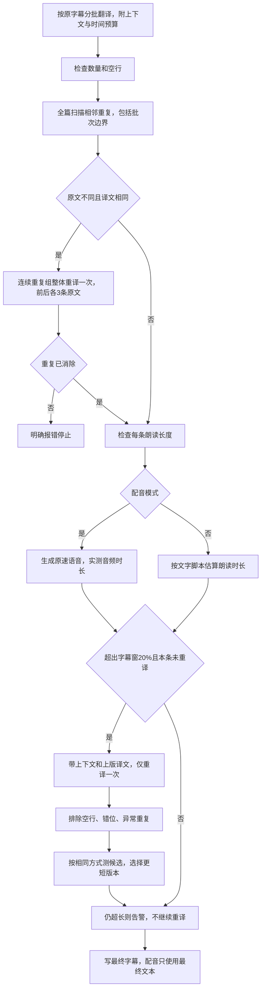

# 字幕翻译质量检查

## 目标

保留逐条时间轴，以代码检查补足翻译提示词；纠正相邻重复，限制超长重译次数，使用真实配音时长比较配音候选。

## 有效规则

- 原文与译文分别去掉排版空白后比较；不删除标点，不改变大小写。扫描复杂度为 O(n) 加文本长度，样本原片共 505 条。
- 每条字幕最多参与一次质量重译。重复检查优先，已用于修正重复的条目不再追加压缩请求。
- 长度条件严格为大于 1.2 倍，恰好等于不触发。候选必须有效；同长和更长保留首版。
- 配音任务比较同一引擎、音色、用户语速下的生成音频，在合并和后期变速之前测量。旧任务已经被变速的音频不充当自然朗读基线。
- 仅翻译时使用启发式：中日韩表意字符和数字每秒 4 个，其他按连续字母组成的词每秒 2.5 个。混合文本相加，标点不计；这不是声学测量，多语言语速不保证准确。
- Google、必应、DeepLX 保留原引擎，不为质量重译切换服务；OpenAI 在每次首译和重译中带前后各 3 条原文。
- 所有首译完成后统一检查，代价是配音启动推迟。候选音频隔离保存；只有最终文本与音频指纹一致时交给后续配音消费者。
- 提示词加强事实、数字、因果、否定、术语口语化、短语上下文和逐条归属。代码不宣称能判定一切语义错误。
- 外层步骤重试识别翻译质量错误并立即停止，不重置已经消耗的质量重译预算；其他步骤保留原有网络重试。

## 验收

1. 旧流程跨批重复回归确实失败，接入检查后相同用例通过。
2. 覆盖合法重复、连续重复组、无效返回、20%边界、上下文、长短选择、重译预算和音频指纹。
3. 同一真实源字幕、同一配音设置下生成旧译与新译语音，逐条比较，而不是对比已经变速的旧成品。
4. 仅调用翻译和配音，不运行听写、视频合成或字幕烧录。
5. 构建、静态检查和相关测试通过，已有告警单独列明。
