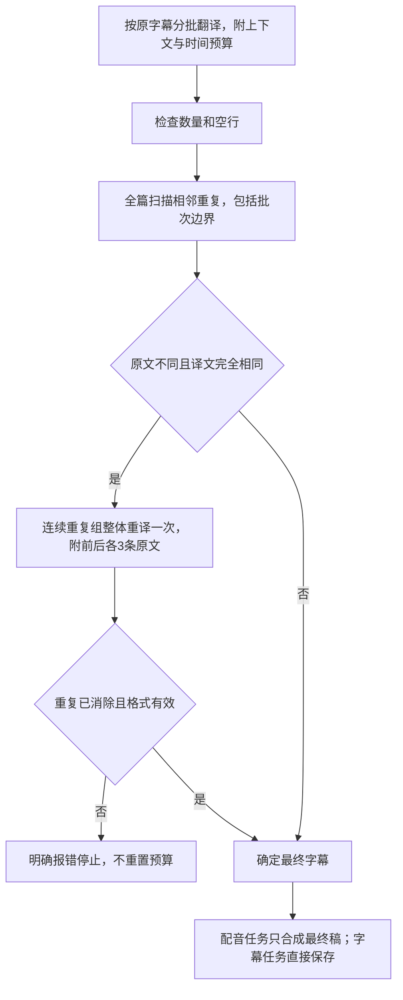

# 字幕翻译质量检查

## 目标

保留逐条时间轴，用中上表现的首译提示词改善口语长度；代码只对确定的异常相邻重复进行一次纠错，避免收益有限的超长重译和试配音增加等待。

## 有效规则

- 首译提示词采用 `candidates` 实测版本：同一次请求内比较忠实口语与精简口语，不增加接口调用；保留事实、数字、否定、因果和语气。
- 原文与译文分别去掉排版空白后比较；保留标点和大小写。扫描复杂度为 O(n) 加文本长度，样本原片共505条。
- 每条最多参与一次重复重译。连续重复组整体纠正，重译仍重复则报错。原文真实重复允许保留。
- 长度只通过首译时间预算与口语压缩引导。运行时不做超过20%后的二次翻译、预先试配音、候选音频选择或文本长度估算重试。
- Google、必应、DeepLX保留原引擎；OpenAI首译与重复重译携带前后各3条原文。自定义提示词也追加核心质量规则。
- 所有首译收齐后检查，再送入配音；最终音频沿用文本指纹和断点复用。
- 外层步骤重试识别质量失败后停止，不刷新已消耗的重复重译预算。
- 完全相同检查不保证语义正确；提示词也不保证所有句子都能装进原时间窗。

## 验收

1. 超长译文在字幕和配音模式均不触发额外翻译或预先配音；旧流程应让此测试失败。
2. 重复组只重译一次；跨批重复在送入配音前修正；原文合法重复不重译。
3. 实际配音入口只收到最终稿，每条首次正常配音一次，文本指纹一致。
4. 用真实源字幕调用指定翻译服务，保留产物和调用日志；不重新听写、不合成视频。
5. 相关测试、静态检查、后端测试及应用构建通过。
