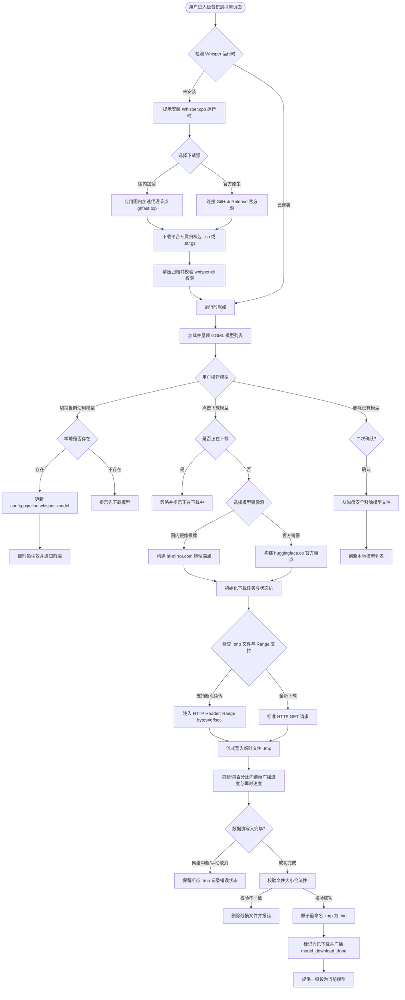
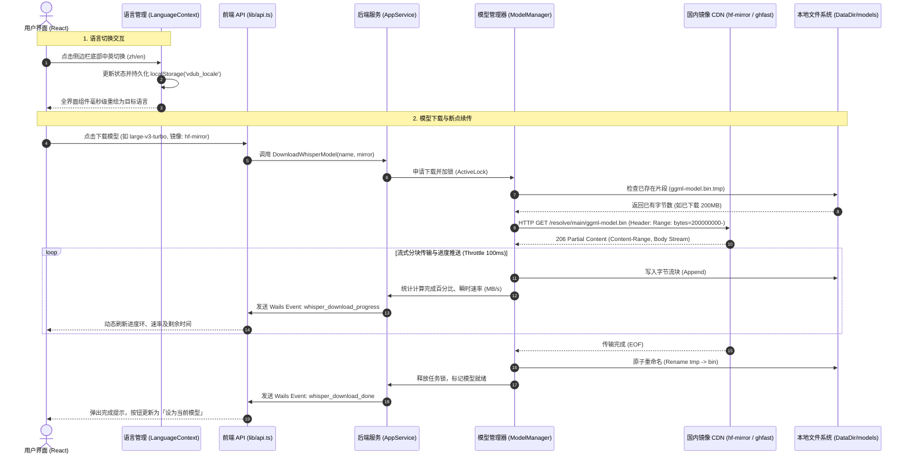
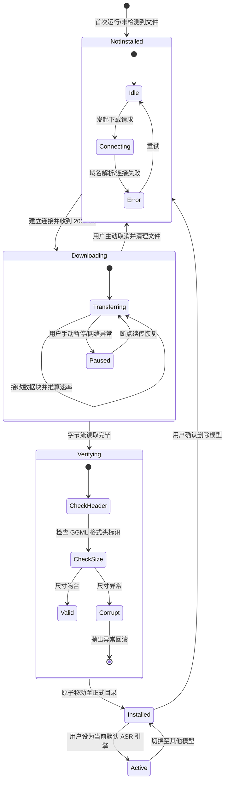
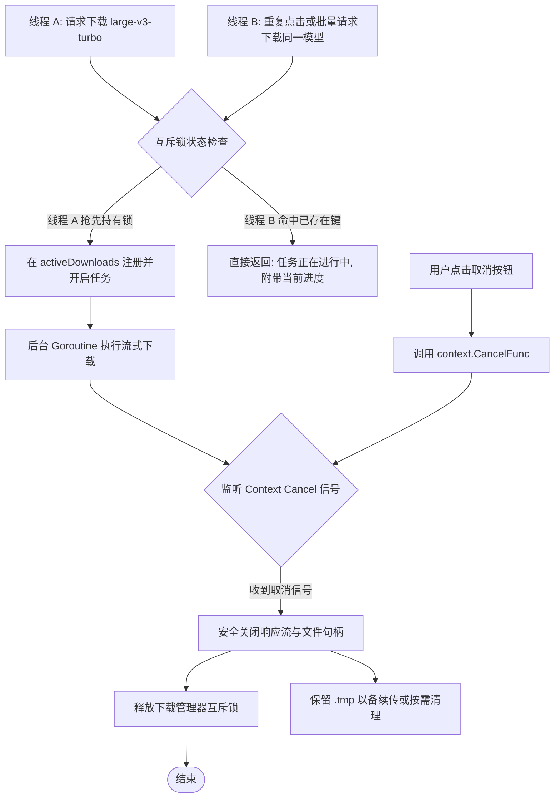

# Whisper.cpp 跨平台运行时与模型管理架构设计

## 需求目标

VDub 的语音识别（ASR）核心依赖 Whisper.cpp 原生执行环境。目前 Windows 与 macOS 用户在首次使用或切换模型时，面临三大核心痛点：一是国内网络环境下，从官方 GitHub Releases 与 Hugging Face 下载运行时和大体积 GGML 模型（100MB~3GB）经常遇到连接超时、速度极慢甚至无法建立连接；二是缺乏跨平台（Windows .zip 与 macOS .tar.gz）的自动化安装与断点续传管理机制；三是软件目前界面仅支持中文，亟需在侧边栏底部操作区提供中英双语即时切换能力，以满足海内外不同用户群体的多语言使用诉求。

### 问题-后果-方案明细表

| 编号 | 问题场景 | 不解决的后果 | 解决方案 | 状态 |
|------|----------|-------------|---------|------|
| 1 | 国内用户直接请求 Hugging Face 官方地址下载 GGML 模型文件 | 连接被重置或下载速率仅几十 KB/s，用户任务严重受阻 | 自动并发网络竞速探测（`hf-mirror.com` vs `huggingface.co` 等），自动择取延迟最低、连通最优节点，无需用户手动干预 | 实施 |
| 2 | 国内用户直接从 GitHub Release 下载 Whisper.cpp 预编译二进制 | 运行时下载失败，导致无法启动语音识别引擎 | 自动并发探测 GitHub 代理镜像（`ghfast.top`、`ghproxy.net`）与原源，自动切换最优加速通道 | 实施 |
| 3 | Windows 与 macOS 平台归档格式与二进制执行方式差异 | Windows 依赖 `.zip` 及 `whisper-cli.exe`，macOS 依赖 `.tar.gz` 及 `whisper-cli`，解压与路径处理易出错 | 抽象跨平台运行时适配器，支持 Windows `.zip` 与 Unix `.tar.gz` 自动化解包与权限赋予（`0755`） | 实施 |
| 4 | 大模型（如 large-v3 3.1GB）下载途中网络抖动或用户意外退出 | 产生残留残缺文件，再次启动需从头下载，耗费大量时间与带宽 | 实现 HTTP Range 断点续传与 `.tmp` 临时文件保护机制，下载完成后执行原子重命名 | 实施 |
| 5 | 下载资源散乱在系统各处，难于集中治理与清理 | 占用用户不可见目录，卸载或迁移时残存大量数 GB 废弃权重文件 | 所有下载的运行时和模型文件统一收口于用户家目录 `~/.lark-studio` 下集中管理 | 实施 |
| 6 | 界面目前为纯中文，缺少英文国际化支持 | 海外用户及习惯英文界面的用户无法顺畅使用 | 构建轻量类型安全的前端 i18n 系统，在侧边栏底部主题切换旁提供一键中英文切换 | 实施 |

---

## 跨平台技术矩阵对比表

| 对比维度 | macOS 平台 | Windows 平台 |
|---|---|---|
| **二进制名称** | `whisper-cli` | `whisper-cli.exe` |
| **归档分发格式** | `tar.gz` | `zip` / `tar.gz` |
| **硬件加速框架** | Apple Silicon Metal (GPU) 自动开启 | AVX2 / CPU / DirectML (可拓展) |
| **默认存储目录** | `~/.lark-studio/models/` | `~/.lark-studio/models/` |
| **解包处理逻辑** | `archive/tar` + `compress/gzip`，恢复可执行权限 `0755` | `archive/zip`，提取至目标运行时目录并生成绝对路径 |
| **探针执行命令** | `whisper-cli -m __probe__ -f /dev/null` | `whisper-cli.exe -m __probe__ -f NUL` |

---

## 主流程图 (flowchart TD)

---

## 核心时序图 (sequenceDiagram)

---

## 模型与运行时状态机图 (stateDiagram-v2)

---

## 并发冲突与容灾保护场景

---

## 国际化架构 (i18n) 设计

1. **存储设计**：
   - 键名：`localStorage.getItem('vdub_locale')`
   - 支持枚举：`'zh-CN'` (简体中文，默认) 与 `'en-US'` (English)
2. **上下文封装**：
   - 创建 `frontend/src/i18n/index.tsx` 提供 `LanguageProvider` 与 `useTranslation()`。
   - 提供 `t(key: string, params?: Record<string, string | number>): string` 函数，支持嵌套键路径及插值变量替换。
3. **语言包目录**：
   - `frontend/src/i18n/locales/zh-CN.ts`
   - `frontend/src/i18n/locales/en-US.ts`
4. **触发位置**：
   - 侧边栏 `Sidebar.tsx` 最底端，与暗黑/明亮主题切换按钮横向并列。
   - 采用精致的药丸微按钮，直观呈现当前语言与切换动作。
