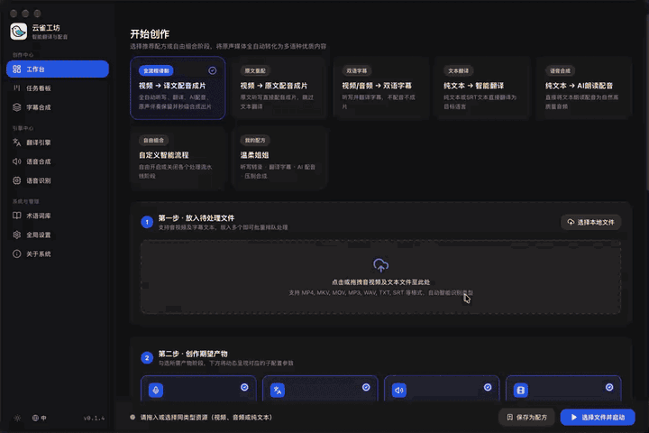

  

<h1 align="center">云雀工坊</h1>

集字幕、翻译与配音于一体的桌面工作台。

<a href="README.md">English</a> | 简体中文

云雀工坊将语音识别、字幕翻译、语音合成和视频合成整合在同一个桌面应用中。你可以为视频或音频生成字幕、翻译已有文本、生成旁白，也可以将这些步骤组合成完整的视频配音流程。

## 主要功能

- **从语音生成字幕。** 使用本地 Whisper.cpp 模型或 OpenAI 兼容语音识别服务，将视频和音频转录为字幕。
- **翻译字幕与文本。** 支持必应、谷歌及 OpenAI 兼容大模型。通过词库管理常用名称和专业术语，帮助大模型翻译保持用词一致。
- **生成语音与配音。** 支持 Edge TTS 和 OpenAI 兼容语音服务，可选择音色、调整语速，也可填写服务支持的自定义模型和音色名称。在设置中即可试听兼容 TTS 服务的音色。
- **制作带字幕的视频。** 可输出独立字幕文件、封装可切换的软字幕，或将字幕直接烧录到画面中。还可将翻译后的语音与视频合成为配音成片。
- **使用已有字幕。** 在独立字幕合成工作台中导入 SRT、VTT 或 ASS 文件，支持单语和双语字幕布局。
- **批量处理文件。** 可一次选择多个文件，使用流程预设，也可保存自己组合的转录、翻译、语音和视频输出设置。
- **跟踪任务进度。** 在任务看板中查看处理阶段、进度、日志和生成的文件。
- **切换界面语言与主题。** 支持简体中文和英语界面，以及浅色、深色主题。

## 支持的引擎与能力

| 能力 | 可用选项 |
| --- | --- |
| 语音识别 | 本地 Whisper.cpp；OpenAI 兼容语音识别 API |
| 本地语音模型 | 在应用中下载和选择模型，包含约 75 MiB 的轻量多语言 Whisper tiny 模型 |
| 翻译 | 默认推荐必应；谷歌；OpenAI 兼容大模型 |
| 语音合成 | Edge TTS；支持自定义模型和音色名称的 OpenAI 兼容语音 API |
| 字幕合成 | 导入 SRT、VTT、ASS；单语或双语字幕 |
| 视频输出 | 独立字幕文件、软字幕、烧录字幕和配音视频 |

## 常用流程

| 输入 | 输出 |
| --- | --- |
| 视频或音频 | 转录字幕与翻译字幕 |
| 视频 | 翻译后的配音与合成视频 |
| 视频 | 跳过翻译的原语言配音视频 |
| 纯文本或 SRT 文本 | 指定语言的译文 |
| 文本 | 朗读音频 |
| 视频与已有字幕文件 | 带单语或双语烧录字幕的视频 |

## 开始使用

1. 打开引擎设置，选择语音识别、翻译和语音合成服务。
2. 使用本地识别时，在语音识别页面安装 Whisper.cpp 运行时并下载模型。使用兼容 API 时，填写服务所需的接口地址、模型和凭据。
3. 在工作台添加文件或文本，选择流程预设，并调整语言、音色和输出选项。
4. 启动任务，在任务看板中查看进度并打开处理结果。

本地 Whisper.cpp 在运行时和模型安装完成后，于电脑上执行语音识别。在线翻译、语音合成和语音识别服务需要网络连接，并会接收处理所需的内容。可用语言和音色取决于所选引擎。

## 开发

桌面层使用 Go 和 Wails，界面使用 React 和 TypeScript。运行 `make dev` 即可启动开发环境。
